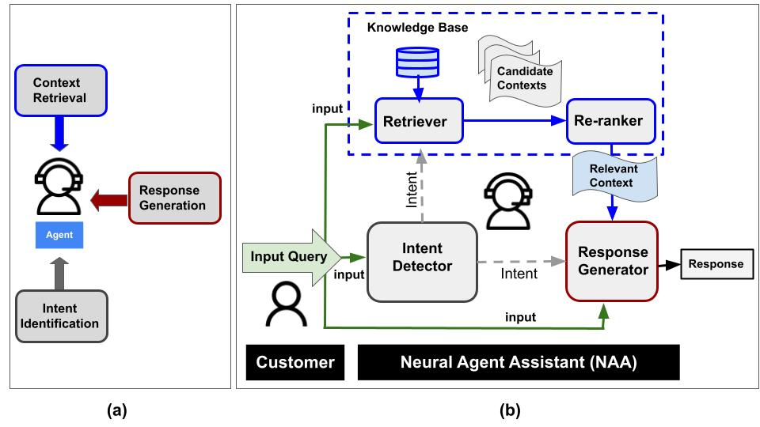
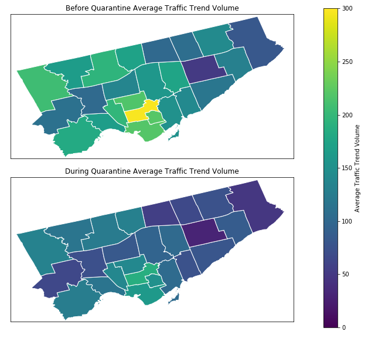
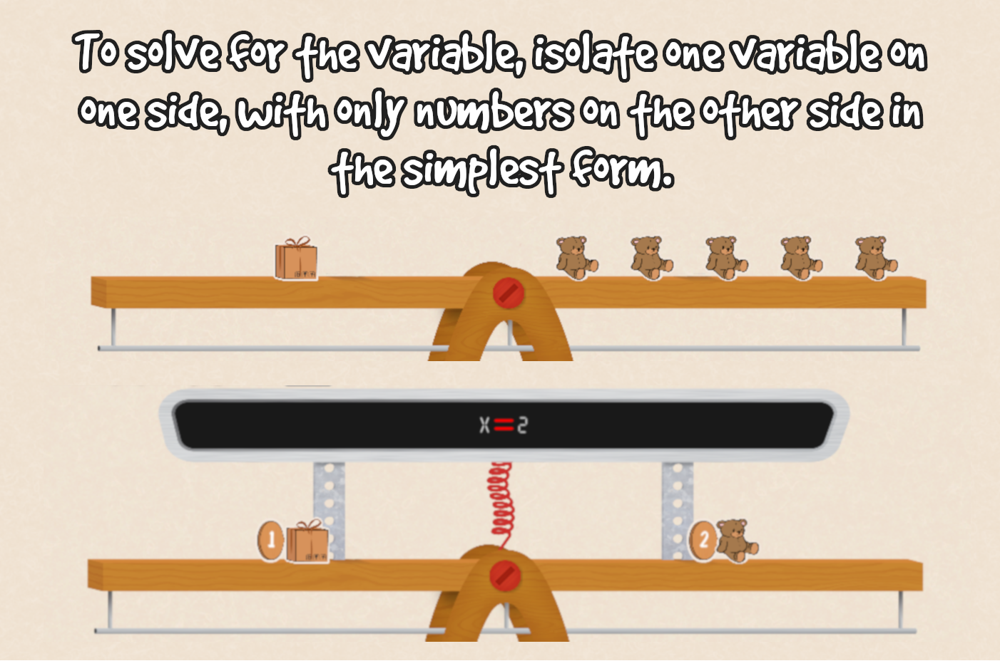

# Hello There 👋 

<!---
ShirleyWangCVR/ShirleyWangCVR is a ✨ special ✨ repository because its `README.md` (this file) appears on your GitHub profile.
You can click the Preview link to take a look at your changes.
--->
Thanks for popping by my github!

- 👋 Hi, I’m Shirley Wang.
- 👀 I’m interested in novel image segmentation models and algorithms, and other interesting computer vision projects.
- 🌱 I have recently completed my Msc at UofT!
- 🔭 I’m currently looking for job opportunities in the Toronto / Vancouver / Seattle area! I'd love to collaborate on some interesting ML problems.
- 😄 In my free time I love learning about new topics, algorithms, and subjects. I also love cats, playing piano, card games, and trying out new foods.

### Connect With Me!

        

## My Masters Research

#### Masters of Computer Science | University of Toronto (2022-2024)

#### Supervisor: Sanja Fidler

## Work Experience

#### Conversational AI for Customer Service Chatbots  •  [Video Demo](https://youtu.be/B1clXX_V1bQ?si=TUZSaT30pYu5dBIJ)  •  [Github](https://github.com/VectorInstitute/NAA/tree/main)  •  [Paper](https://aclanthology.org/2022.emnlp-industry.44/)

Applied Machine Learning Intern | Vector Institute (2021)

- Researched practical methods for creating domain-specific Conversational AI.
- Finetuned LLMs like GPT2 for multiple NLP tasks, adopting existing techniques to create models capable of extracting reasonable answers to queries from a given context in a natural dialogue manner, which perform well in both zero-shot and finetuned settings.
- Implemented a standardized data pipeline into finetuning the model for any domain-specific dataset.

#### Database Management

Data Engineer | Xero - Hubdoc (2020-2021)

- Maintained company’s data warehouse and data pipeline by creating and debugging ETL jobs using SQL, Javascript, and Python.
- Mapped out dependencies and created new DAGs to migrate the company data pipeline from a hard-coded schedule to Apache Airflow.
- Created dashboards and tables of KPIs for monthly reporting and other requirements.
- Worked with AWS Lambdas, S3, and Redshift to implement better database monitoring and archiving solutions.

## Projects

#### Driving During Quarantine (2020)  •  [Github](https://github.com/DataFestUofT/submit-project-shirley_eva/)  •  [Presentation](https://github.com/DataFestUofT/submit-project-shirley_eva/blob/master/DatafestSlideDeck.pdf)

Won 1st Place Best in Show at the UofT@Datafest2020.

Performed time series analysis using a linear mixed model on traffic data in the Greater Toronto Area to show the effects of the Covid lockdown on Toronto life.

#### Packing Disaster: Educational Video Game to Teach Algebra (2019)  •  [Github](https://github.com/ShirleyWangCVR/PackingDisasterV2)  •  [Development Blog](https://csc399shirty.home.blog/)

Created a video game in C# and Unity, designed to teach basic algebra to children. This is done by representing variables with boxes, and numbers with toys. Done in collaboration with Professor Steve Engels.

#### Rhythm Game in Verilog (2019)  •  [Github](https://github.com/ShirleyWangCVR/CSC258-Rhythm-Game/)

Basic rhythm game programmed entirely in Verilog, played on four keys with some extra code to generate songs.

DEMO (Unravel from Tokyo Ghoul)

## Blog Posts

- [Is AI is Coming for the Music Industry?](https://medium.com/demistify/is-ai-is-coming-for-the-music-industry-885c11efbac2)
- [DALL-E could be Friends with Flamingo](https://medium.com/demistify/dall-e-could-be-friends-with-flamingo-49440fcbbdab)
- [Scientific Reasoning Told Me To Write This Article (featuring Meta AI)](https://medium.com/demistify/scientific-reasoning-told-me-to-write-this-article-featuring-meta-ai-8ad38452611)
- [PaLI: Google Once Again Suggests Scaling Up Models](https://medium.com/demistify/pali-google-once-again-suggests-scaling-up-models-867b22c1136d)
- [Can This Model Generate My Head Exploding (.mp4)? Probably Not](https://medium.com/demistify/can-this-model-generate-my-head-exploding-mp4-probably-not-f39c866b5ad7)
- [Adding Noise Until The Model Can Generate My Head Exploding (.png): A Brief Overview of Diffusion Models and DALL-E 2](https://medium.com/demistify/adding-noise-until-the-model-can-generate-my-head-exploding-png-7e31f672dd3c)
- [Generate Stylized MNIST Digits (and Other Cool Stuff) with Differentiable Rasterization](https://utorontomist.medium.com/generate-stylized-mnist-digits-and-other-cool-stuff-with-differentiable-rasterization-faa757e8cc4)
- [Rotating The Way We View Position Embeddings](https://utorontomist.medium.com/rotating-the-way-we-view-position-embeddings-8a5aebc9ee1)

